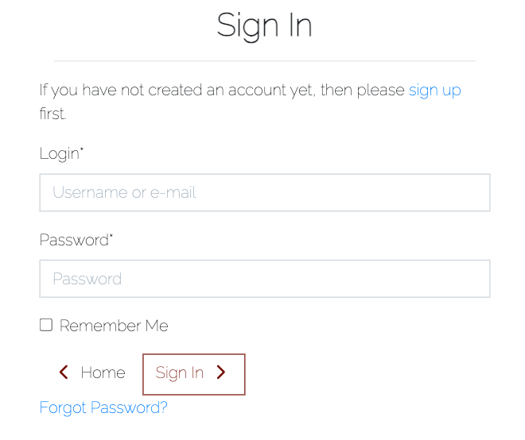

<h1 align="center">Clay & Fire Jewellery</h1>

### **Live Site**
[Clay & Fire Repository](https://github.com/SamanthaBooth81/foody-family)

### **Repository:**
[Clay & Fire Live Site](https://foody-family.herokuapp.com/)

# About

 

# Table of Contents

[User Experience](#user-experience)

[Features](#features)

[Features to be Implemented](#features-to-be-implemented)

[Wireframes](#wireframes)

[Databases](#databases)

[Technologies Used](#technologies-used)

[Testing](#testing)

[Validator Testing](#validator-testing)

[Bugs Found](#bugs-found)

[Deployment](#deployment)

[Credit](#credit)

[Acknowledgments](#Acknowledgments)

# User Experience
## User Stories
### Superuser / Admin

### Shopper

# Features
- Landing Image

- Navbar 

- Navbar - Account holders

- Filters

- Products List

- View Full Product Details 

- Create an account

- Login

- Change Password

- Footer

## Admin Features
- Add products

- Edit Products

- Delete Products

## Colour Scheme 

The colour scheme for the project was put together using [Adobe Color](https://color.adobe.com/create/image) by uploading the landing page image. The colour scheme decided is:

## Font Choice

I chose the Google Font Raleway to act as the primary font for the website, including for the logo.

 **ADD FONT IMAGE**

## Favicon 
I created a basic Favicon for this project using [Canva](https://www.canva.com/). 

 **ADD FAVICON IMAGE**

# Features to be Implemented

# Wireframes
All wireframes were created used [Balsamiq](https://balsamiq.com/)

Clay & Fire Wireframes for Mobiles, Tablets and Desktop devices can be viewed [here](assets/documents/Wireframes.pdf).

# Structure
I have kept the structure simple to not crowd the user with information. The homepage contains all of the recipes that are approved by the superuser/admin, which is also paginated therefore limits the recipe cards to 12 per page. 

The website is made of the following apps:
1. Home
2. Products
3. 

## Databases

### User

For this I project I used Django's User model to store registration information allowing the users to create an account. Once an account has been created the user is able to create, update and delete their own recipes on the site. 

### Recipes

For the user to be able to upload their own recipes I have created the below Recipe Model:

All fields are required apart from Author - which is based on the user who is currently logged in, Featured Image - which uses a placeholder if no image is uploaded and Excerpt - which is for the user to add any additional notes if required. 
# Technologies Used

## Languages Used

[html](https://en.wikipedia.org/wiki/HTML)

[CSS](https://en.wikipedia.org/wiki/CSS)

[Python](https://www.python.org/)

[JavaScript](https://www.javascript.com/)

## Frameworks, Libraries and Programmes Used 

[GitHub](https://github.com/) - Holds the repository of my project, GitHub connects to GitPod and Heroku.

[GitPod](https://gitpod.io/workspaces) – Connected to GitHub, GitPod hosted the coding space, allowing the project to be built and then committed to the GitHub repository. 

[Heroku](https://www.heroku.com/) - Connected to the GitHub repository, Heroku is a cloud application platform used to deploy this project so the backend language can be utilised/tested. 

[Django](https://www.djangoproject.com/) - This framework was used to build the foundations of this project, reducing time spent getting the project setup and prevent re-writing existing code.

[Bootstrap](https://getbootstrap.com/) - Used to quickly add design to my website, Bootstrap focuses on mobile first design meaning this website is responsive across multiple devices ans screen sizes.

# Testing
## Manual Testing by User Story
### **Superuser / Admin**

### **Buyer**

## General Manual Testing 
**Add Product**
- Adding multiple recipes of various sizes to ensure:
    - Entire Recipe saved in the database, including all ingredients and instructions to be later displayed correctly in the recipe detail page.
- Image Upload testing:
    - Uploaded multiple recipes with and without an image to ensure any images uploaded were stored to Cloudinary, otherwise, the placeholder image was displayed. 
- Duplicate Recipe Titles:
    -   Checking an error message alerts the user of a duplicate title.
    - Added the author name to the recipe detail slug to allow for slightly more flexibility with recipe titles.
- Required Form Fields:
    - Submitting empty recipe form to ensure all required fields are notifying the user if left empty.
- Adding Ingredients and Instructions:
    - Using Google Chromes Inspect to check all entries are given a unique ID for editing later.
    - Clicking the add and delete buttons to make sure they add and remove the widgets. Double checking they are removed via the Recipe Detail page. 

**Edit Product**
- Retrieving the chosen recipe for editing:
    - Match the recipe details from the details view with the edit view across multiple recipes.
- Able to change and save changes to recipe:
    - Making changes and raising error messages if inputs are invalid, fields are blank or title is not unique.
    - Check changes are saved to the correct recipe by viewing the details after making changes. 

**Delete Product**
- Retrieving the chosen recipe to be deleted:
    - Checking the list of recipes to ensure the correct recipe was deleted
- Delete Confirmation:
    - Ensuring there is a confirmation page for the user so the recipe isn't automatically deleted.
    - Checked that although the delete button click, if not confirmed, the recipe is still on the recipe list (both the users list and homepage).

**View List of Products**
- Visual check to see if only recipes that have been approved on the homepage. Checked against the Django Admin page. 
- Checked to see if approved recipes by all users are displayed on the home page. Checked against the Django Admin page. 
- Displays only the users posted recipes on the Posted Recipes Page. Checked the author of all recipes is the same on every recipe.
- Displays only the pending approval recipes on the Recipes Pending Approval Page. Checked the author of all recipes is the same on every recipe.
- Checked the placement of the recipe cards works on all screen sizes.
- Checked total recipe cards per page is 12 and that the pagination appears if there are multiple pages by adding over 12 recipes both by 1 user and multiple users. These were deleted later when testing the delete recipe functionality.  
- Checked the recipes are ordered by updated date by editing a recipe and checking it became the first recipe on the page. Also checked the order of the recipes in the admin to ensure it matched. 

**View Product Details**
- Adding multiple recipes of various sizes to ensure:
    - The layout works as expected, especially on mobile devices where the page layout is as a list. On larger devices Ingredients and Method list side by side.  
    - The images displayed correctly, whether uploaded by the user or using the placeholder image instead.
    - The recipe details were displaying the correct recipe chosen to be viewed.

**User Registration**

**Peer Code Review**

# Validator Testing

- The HTML templates were validated using [W3 Validator](https://validator.w3.org/nu/#textarea). No errors were returned for the html segments.
- The CSS style sheet was validated using [W3C Validator](https://jigsaw.w3.org/css-validator/#validate_by_input), no errors were returned.
- The JavaScript files were run through [JSHint](https://jshint.com/), no errors were found.
- The code was validated using [PEP8](http://pep8online.com/). No errors were returned.
- The finished project was also run through [Wave](https://wave.webaim.org/) to check for issues with contrast styling and html structure. 

# Bugs Found 

I encountered the following issues whilst building this project:

# Deployment 

This project was deployed using Heroku. Some of the steps in this deployment process are used to get the bare minimum of this project up and running prior to adding functionality. 

See the following steps to deploy below:

1. Login to Heroku and Create a New App.

 

2. Give the App a name, it must be unique, and select a region. 

 

3. Click on 'Create App'. This will take you to a page where you can deploy your project. 

4. Next, click on the 'Resources' tab and search for 'Heroku Postgres' in the Add-ons section to add the Heroku Postgres database to the project. 

5. Click on the 'Settings' tab at the top of the page. The following steps must be completed before deployment.

 

6. Scroll down to Config Vars (also known as Environment Variables) and click 'Reveal Config Vars'. Here the database URL is stored, it is the connection to the database, so this must be copied and stored within env.py file within the same directory as the manage.py file. 

The env.py files is where the projects secret environment variables are stored. This file is then added to a gitnore file so it isn't stored publicly within the projects repository.  

7. Next, the secret key needs to be created within the projects env.py file on GitPod and then added to the Config Vars on Heroku. Once added, go to the settings.py file on GitPod.

8. Within the settings.py file you need to import os, import dj_database_url and then write an if statement to import the env.py file in production to avoid an error. 

9. Then, we need to replace the current insecure secret key with **os.environ.get('SECRET_KEY')**, that we set within the env.py file. 

10. Once the secret key is replaced, scroll down to DATABASES to connect to the Postgres database. Comment out the current code and add the following python dictionary:
DATABASES = {
    'default': dj_database_url.parse(os.environ.get('DATABASE_URL'))
}

11. The next step is to connect the project to Cloudinary, which is where the media files will be stored. Log into Cloudinary and copy the API environment variable. This needs to be added to the Config Vars on Heroku and to the projects env.py file, removing the 'CLOUDINARY_URL = ' from the beginning of the copied API link. 

12. Then on Heroku add to the Config Vars, DISABLE_COLLECTSTATIC = 1, as a temporary measure to enable deployment without any static files, this will be removed when it is time to deploy the full project.

13. Back onto GitPod, the cloudinary libraries installed now need to be added to the list of installed apps within the settings.py file - 'cloudinary_storage' and 'cloudinary'

14. Next we need to tell Django to use Cloudinary to store our media and static files. Toward the end of our settings.py  file we can add:

- STATIC_URL = '/static/'
- STATICFILES_STORAGE = 'cloudinary_storage.storage.StaticHashedCloudinaryStorage'
- STATICFILES_DIRS = [os.path.join(BASE_DIR, 'static')]
- STATIC_ROOT = os.path.join(BASE_DIR, 'staticfile')
- MEDIA_URL = '/media/'
- DEFAULT_FILE_STORAGE = 'cloudinary_storage.storage.MediaCloudinaryStorage'

15. Then we need to tell Django where the templates will be stored. At the top of settings.py, under BASE_DIR (the base directory), add a templates directory and then scroll down to TEMPLATES and add the templates directory variable to 'DIRS': []. 

16. Next, create the three above directories, media, static and templates, on the top level with the manage.py file. 

17. Now add our Heroku host name into allowed hosts in our settings.py file, APP_NAME.herokuapp.com, and then also add 'localhost' so the app can also run locally.

18. Finally, to complete the first deployment set up of the skeleton app, create a Procfile so that Heroku knows how to run the project. Within this file add the following:
web: gunicorn foody_family.wsgi
Web tells Heroku to allow web traffic, whilst gunicorn is the server installed earlier, a web services gateway interface server (wsgi). This is a standard that allows Python services to integrate with web servers.

19. Now, go to the 'Deploy' section on Heroku. Find the 'Deployment Method' section and choose GitHub. Then, connected to the relevant GitHub Repository by searching the repository name and clicking 'Connect'.

 

 

20. Scroll down to the Automatic and Manual Deploys sections. I then clicked 'Deploy Branch' in the Manual Deploy section and waited as Heroku installed all dependencies and deployed my code. 

 

21. Once the project is finished deploying, click 'view' to see the newly deployed project. 

22. Before deploying the final draft of your project you must: 
- Remove staticcollect=1 from congifvars within Heroku 
- Ensure DEBUG is set to false in settings.py file or:
    - Set DEBUG to development with: *development = os.environ.get('DEVELOPMENT', False)* above it.

23. To deploy re-do steps 19 - 21, minus reconnecting your GitHub account as it should still be connected to your App. 

# Credit
## Content 

I used the following websites to help with different areas of my project:

### Styling
- [Unsplash - Landing Image](https://unsplash.com/photos/uRuF9ABj0NY)
- [Logo Font - Google Fonts](https://fonts.google.com/specimen/Raleway?query=raleway)
- [Font Awesome Icons](https://fontawesome.com/)
- [CSS-Tricks - Flexbox Sticky Footer](https://css-tricks.com/couple-takes-sticky-footer/), for the sticky footer code.

### Product Images
- [Pexels - Carpe Jugulum](https://www.pexels.com/photo/orange-and-black-ladybug-on-green-leaf-5035921/)
-[Pexels - Lisa Fotios](https://www.pexels.com/photo/a-woman-with-a-face-shaped-earring-7016917/)
- [Pexels - cottonbro](https://www.pexels.com/photo/close-up-shot-of-a-woman-wearing-a-blue-earring-8541542/)
- [Unsplash - Svitlana](https://unsplash.com/photos/J7ydFF1WyGQ)
- [Unsplash - Kate Hliznitsova](https://unsplash.com/photos/P6NiFTyI294)
- [Unsplash - Sincerely Media](https://unsplash.com/photos/8WebmlRgMp0)
- [Unsplash - Gabrielle Henderson](https://unsplash.com/photos/YGIPzuiD1jc)
- [Unsplash - Gabrielle Henderson](https://unsplash.com/photos/YbA4hHxkSrg)
- [Unsplash - Gabrielle Henderson](https://unsplash.com/photos/O7l3PmbGxF0)
- [Unsplash - Gabrielle Henderson](https://unsplash.com/photos/fR3PIa-WtBg)

### Website Images
- [Pexels - Delivery Image](https://www.pexels.com/photo/person-holding-green-and-white-floral-book-5486791/) CHECK IF USED, REMOVE IF NOT

# Acknowledgments
Thank you to all who encouraged and supported me as I created my first full stack E-Commerce website, especially to my mentor at Code Institute, Antonio, for his guidance, patience, encouragement and constant support. Also a massive thank you to Tutor Support at the Code Institute for never giving up on the difficult issues I found myself stuck on.  